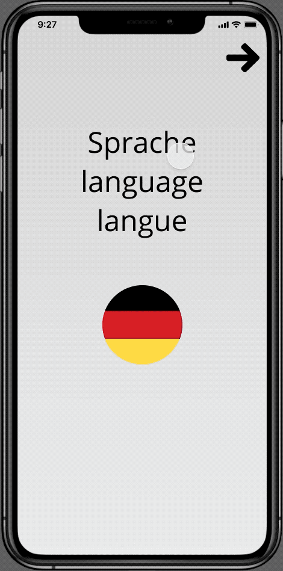
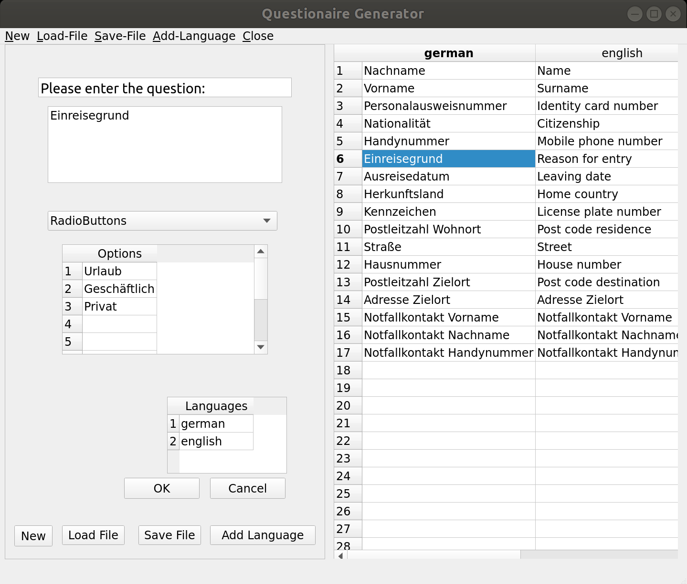
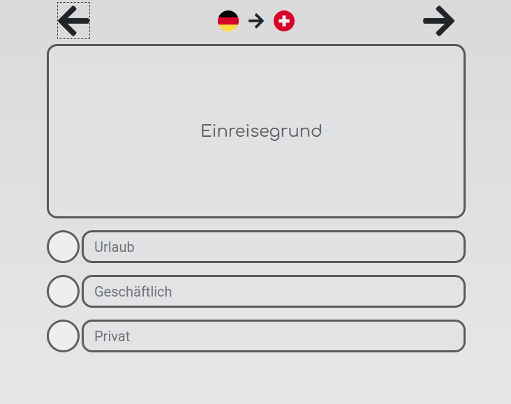
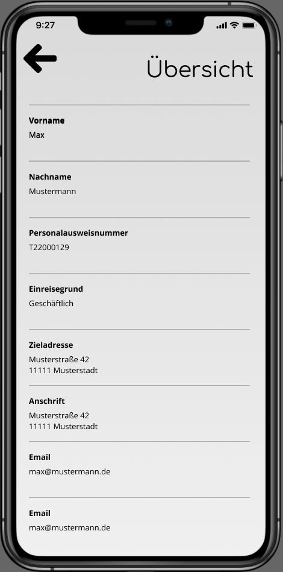

================================
Welcome to the Grenz-er-fahrung!
================================

As part of the WirvsVirus_ hackathon we join the fight against COVID-19.

The last couple of weeks were defined by the spread of the virus around the world. Europe, in particular, rapidly became the epicenter of the current epidemic. As a consequence, borders throughout Europe were closed in a rush leading to heavy traffic jams. Europe's free and borderless market, risks being halted due to merchants, commuters, and truckers being stuck attempting to cross a border.

For this weekend we chose to **hack** together a prototype app that allows officials to provide questionnaires digitally, enabling border crossers to answer questions in advance and reduce the work of border policemen. Checkout our video on YouTube_ to see what we have achieved!

.. _WirvsVirus: https://wirvsvirushackathon.org/
.. _YouTube: https://www.youtube.com/watch?v=klSfAKeN_Ow&feature=youtu.be

Introduction
============

Consider the following user story:

.. topic:: A truck driver delivering goods throughout Europe

   On his journey, the truck driver travels from country A to B but does not speak the language spoken in country B fluently.

   How can the time of the border crossing be minimized?

   A policeman of country B at the border will want to know the truck driver's identity, his destination, and reasons for travel. Most of the time will be lost communicating and answering questions while overcoming the language barrier.

   .. note:: What if the truck driver could answer the questions in advance, **in his own language**?
      
      The time it would take for the policeman to verify the answers would be only a fraction of the time it currently takes and seriously reduces traffic jams all over Europe's closed borders.

  Mock Up of the questions a person crossing the border from Germany to Switzerland might answer answer using our application. 

Application
===========

We took this scenario as a guideline for our application and decided to write the following tools:

* A questionnaire generator allowing officials to upload and distribute questionnaires to people who want to cross their border.
* A client webapp that allows anyone to answer the questions in their own language and generate a QR-Code containing the answers as a URL.
* A website containing the answers in the policeman's language.

Therefore allowing policemen to get answers to all questions they are supposed to ask just by scanning a QR-Code!

In the following the details of our implementation are documented.

Questionnaire Generator
-----------------------

The questionnaire generator is a simple qt based python program that allows officials to generate questionnaires in the shape of a JSON File. The JSON File contains questions and language information.

  Image of the Questionnaire Generator

.. toctree::
   :glob:
   :maxdepth: 2

   source/source_files/project.dict_generator

Border Crosser Webapp
---------------------
The border crosser's web app consists of only one website that, once opened, downloads the correct questionnaire and allows us to generate the resulting QR-Code without any further internet connection.

Our current state looks like this:

  Image of the Border Crosser App

This is how we imagine the app to be used on a mobile device:

Border Police Website
---------------------

Encoded in the QR code is an URL containing all answers of the border crosser. 
The border police can then simply scan the QR code and open the website to see the answers on her/his device.

  Image of the Police Website

Backend: Connecting the Pieces
------------------------------

A flask webserver connects the individual parts of our application. A flask web server is used to serve the questionnaire to border crossers and answers the requests that are triggered when the border police scan's a QR code.

.. toctree::
   :glob:
   :maxdepth: 2

   source/source_files/project.questionaire
   source/source_files/project.questions_from_json
   source/source_files/project.flaskr
